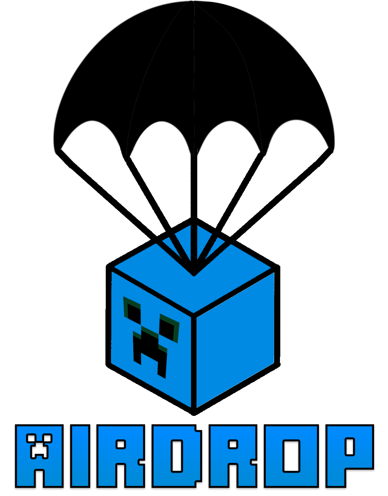

<div style="text-align: center;" align="center">



<h3> <i> From the skies! </i> </h3>

<br />

 

[](LICENSE)
[](https://www.minecraft.net)  [](https://github.com/LukeMccon/Airdrop/releases/latest)

A Paper plugin for customizable care packages with parachutes, effects, economy support, and in-game package editing.

</div>

## Features

- Configurable parachute drops with custom chicken count, fall speed, and drop height
- Landing, flare, glow, and optional smoke particle effects
- In-game GUI package creation and editing
- Economy support through VaultUnlocked's native async API, with original Vault compatibility
- Best-effort refunds for confirmed paid-drop failures while Airdrop remains active
- Bounded request rate, falling entities, landed crates, and landed lifetime
- Language file support (`lang/<language>.yml`) and configurable chat theme colors
- Runtime reload command for config, language, and packages

## Requirements

- Paper `1.21.8+`
- Java `21`
- [LuckPerms](https://luckperms.net/) (required)
- Economy provider when `economy.enabled: true` (default):
  - [VaultUnlocked](https://github.com/TheNewEconomy/VaultUnlocked) with a compatible economy plugin (preferred), or
  - [Vault](https://github.com/milkbowl/Vault) with a Vault-compatible economy plugin (legacy fallback)

If no economy provider is installed, set `economy.enabled: false` in `config.yml` before starting.

## Installation

1. Install plugin dependencies into your server `plugins/` directory:
   - LuckPerms
   - Optional: VaultUnlocked or Vault, plus your economy plugin (if you keep economy enabled)
2. Download the latest Airdrop release from [Releases](https://github.com/LukeMccon/Airdrop/releases/latest).
3. Place the Airdrop `.jar` in `plugins/`.
4. Start or restart the server.

## Quick Start

1. Create a package:

```bash
/airdrop package create starter 10
```

2. Add items in the package editor GUI and click `Save`.
3. Grant players package permissions, for example:

```bash
/lp group default permission set airdrop.package.starter true
```

4. Call in the package:

```bash
/airdrop starter
```

## Commands

All commands start with `/airdrop` (aliases: `/drop`, `/ad`).

- `/airdrop <packageName>`
  - Player-only
  - Drops a package at your location
  - Requires package permission
- `/airdrop package <name>`
  - Shows package details and item list
- `/airdrop package create <name> <price>`
  - Admin-only
  - Player-only (opens GUI)
- `/airdrop package delete <name>`
  - Admin-only
- `/airdrop packages`
  - Admin-only
  - Player-only (opens package management GUI)
- `/airdrop reload`
  - Admin-only
  - Reloads main config, language, and packages
- `/airdrop version`
  - Shows plugin and API versions

## Permissions

- `airdrop.admin`
  - Full administrative access
- `airdrop.package.all`
  - Use all packages
- `airdrop.package.<packageName>`
  - Use one specific package
- `airdrop.package.*`
  - Wildcard alias for package usage
- `airdrop.cooldown.bypass`
  - Bypasses only the per-player request cooldown
  - Granted to operators by default and included under `airdrop.admin`
  - Does not bypass falling or landed capacity limits

LuckPerms integration also ensures these groups exist:
- `airdrop-admin` with `airdrop.admin`
- `airdrop-user` with `airdrop.package.all`

## Configuration

Main settings are in `plugins/Airdrop/config.yml`.

```yaml
language: en

drop:
  parachute:
    chicken-count: 5
  particles:
    landing-effects: true
    continuous-effects: true
    flare-effects: true
    smoke:
      enabled: false
      height: 20
  falling-speed: 0.3
  height: 20
  limits:
    request-cooldown-seconds: 30
    max-falling: 3
    max-landed: 10
    landed-lifetime-seconds: 600

economy:
  enabled: true

logging:
  debug: false

ui:
  chat:
    colors:
      primary: BLUE
      text: WHITE
      accent: AQUA
      success: GREEN
      warning: YELLOW
      error: RED
      error-detail: DARK_RED
```

Validation ranges:
- `drop.parachute.chicken-count`: `1` to `64`
- `drop.falling-speed`: `0.01` to `4.0`
- `drop.height`: `1` to `320`
- `drop.particles.smoke.height`: `0` to `128`
- `drop.limits.request-cooldown-seconds`: `1` to `86400`
- `drop.limits.max-falling`: `1` to `64`
- `drop.limits.max-landed`: `1` to `256`
- `drop.limits.landed-lifetime-seconds`: `30` to `86400`

Limit behavior:

- Capacity and landing-location reservations happen before package items are materialized or economy funds are withdrawn.
- `max-landed` includes landed crates and reserved slots for crates still falling, preventing in-flight overcommit. Existing paid barrels recovered from disk are restored even if they temporarily raise occupancy above the configured value; new drops remain blocked until occupancy falls below it.
- Successful player drops start a UUID-based cooldown; rejected or failed drops do not.
- At `landed-lifetime-seconds`, unpaid crates and empty paid barrels are removed. A non-empty paid barrel keeps its contents and becomes an ordinary barrel.
- `/airdrop reload` applies new limits to future requests without deleting active crates or resetting existing cooldown/expiry deadlines. Lowering a cap below current occupancy blocks new drops until usage falls under the cap.

Packages are stored in `plugins/Airdrop/packages.yml` and can be managed in-game.
A package can contain up to `27` item stacks (barrel capacity).

## Paid Drop Failure and Recovery

Paid-drop handling is fail-closed and does not provide an exactly-once transaction guarantee.

- Airdrop does not keep a runtime transaction journal. If an economy operation times out ambiguously or shutdown begins after it may have committed, Airdrop does not retry it, refund it, or deliver a crate later. A player can therefore be charged without receiving a crate in this rare case. This is deliberate: replaying an ambiguous operation could duplicate money or items.
- A confirmed withdrawal followed by a known pre-landing failure can receive one best-effort refund attempt while Airdrop remains active.
- Paid crates that are still falling are not persisted or recovered.
- A landed paid barrel is recovered only when a graceful chunk save, world unload, or server shutdown persists it as `RECOVERABLE`. Recovery claims that same barrel and its existing inventory; it never reconstructs or inserts items.
- If another plugin suppresses the final chunk or world save, Airdrop rejects the stale `LIVE` disk copy instead of replaying old contents. This can cause charge-without-delivery, but prevents item duplication.
- A hot plugin disable removes paid barrels fail-closed where their worlds are accessible instead of leaving recoverable contents available while Airdrop is inactive.
- Untracked `LIVE` barrels, malformed metadata, and duplicate crate identities are removed fail-closed instead of being recovered.
- At expiry, an empty paid barrel is removed. A non-empty paid barrel keeps its contents, loses its Airdrop metadata, and becomes an ordinary barrel.
- Breaking a landed barrel remains a normal Paper block break. Airdrop releases its tracking without replacing Paper's normal block and inventory drops.

## Version 4 Integration Notes

The 4.0 API intentionally includes these source and binary compatibility changes:

- Package affordability and charging are now handled asynchronously by `DropController`; the old `Package.canAfford(Player)` and `Package.chargeUser(Player)` methods were removed.
- `Crate` construction requires a `DropAdmissionController.Lease` so every crate owns and releases its capacity and location reservations.
- Public `DropController` drop methods now declare the checked `DropLimitException` rejection type.
- Both public `CrateManager.addCrate(...)` overloads now return `boolean` so callers can detect collision-safe registration failure; existing source calls may ignore the result, but previously compiled integrations must be rebuilt.

`airdrop.cooldown.bypass` is new in version 4. No cooldown- or limit-bypass permission shipped in a pre-v4 release, so there is no legacy permission migration or alias to configure.

## Build and Test

- Build plugin jar: `./gradlew clean build`
- Run tests: `./gradlew test`
- Start local Paper test server: `./gradlew runServer`
